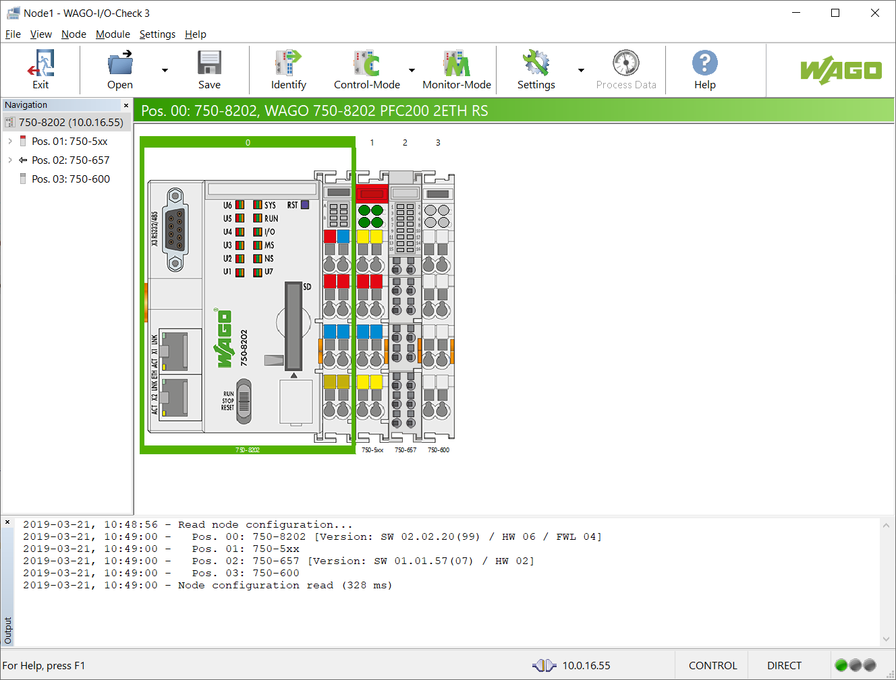
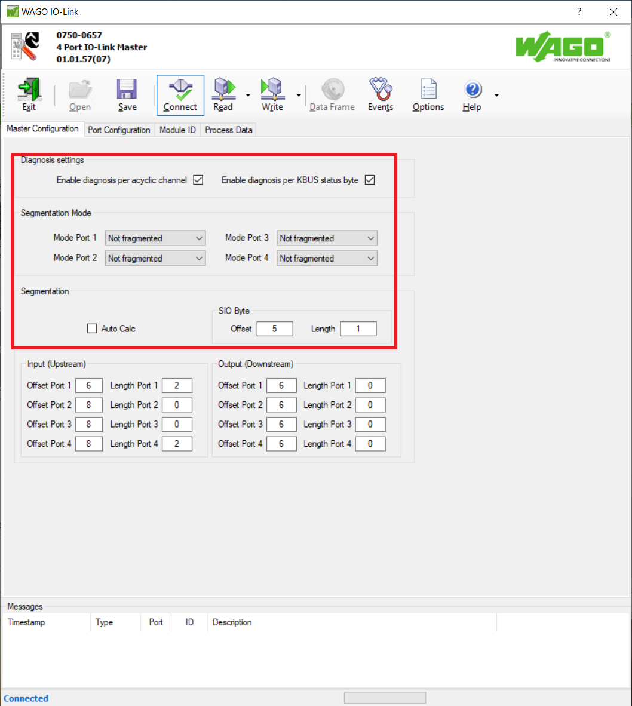
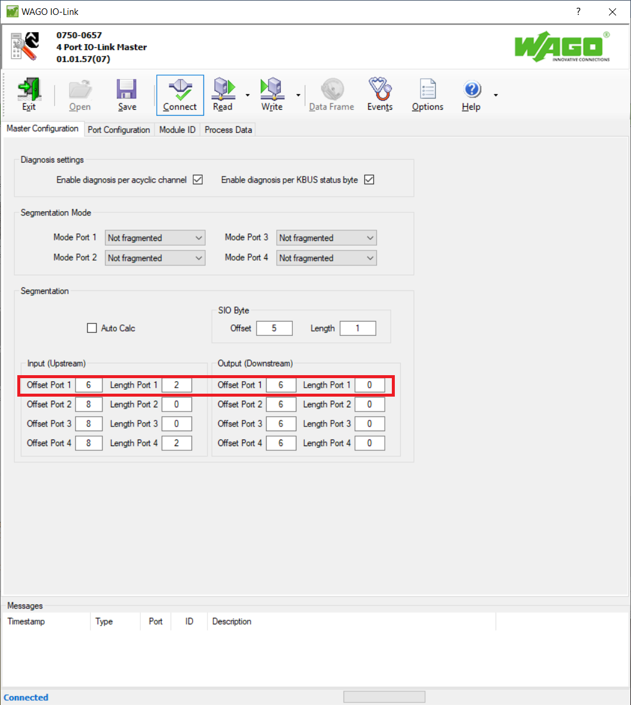
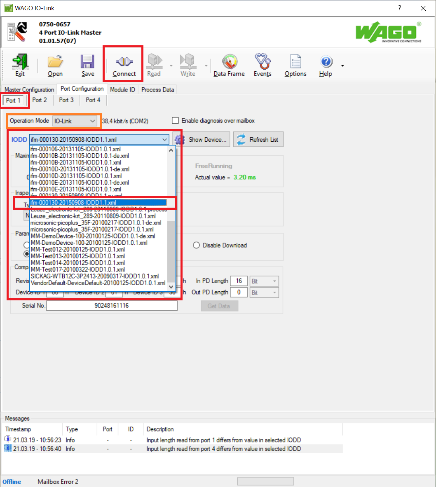
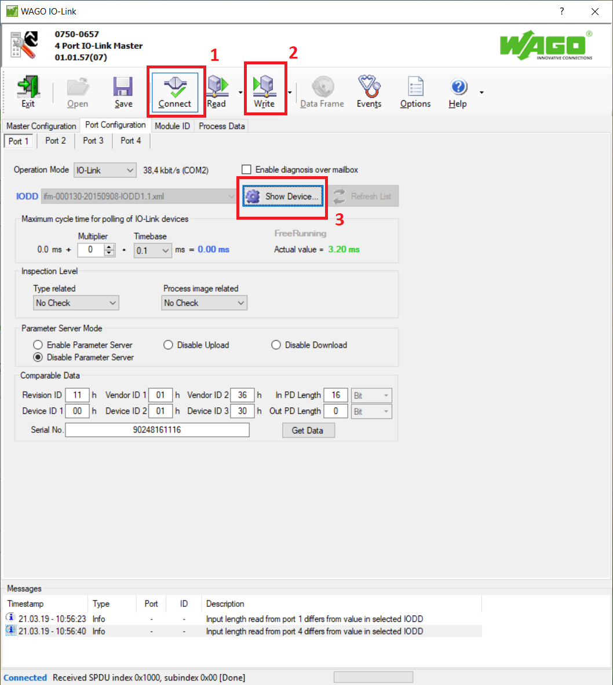
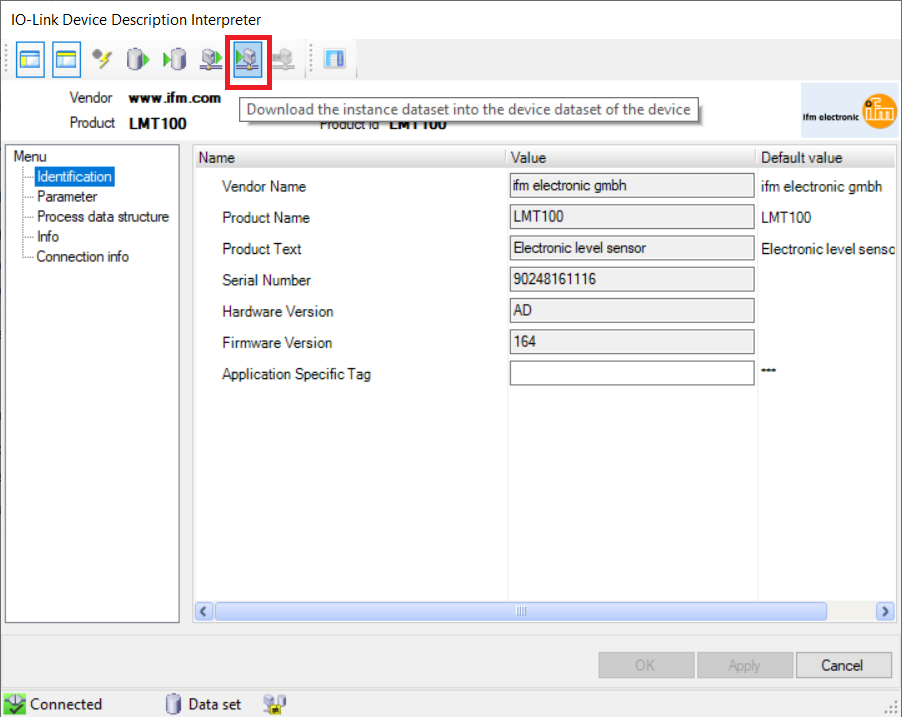
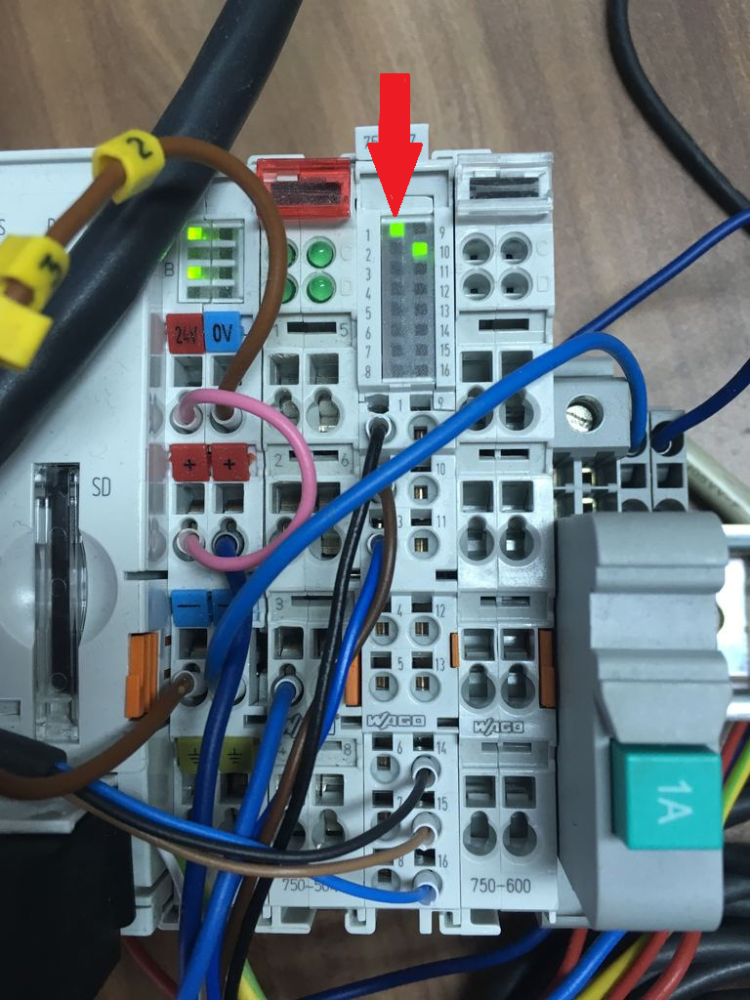

# Настройка на примере датчика предельного уровня IFM **LMT100**.

## Получение IODD-файла описания устройства

Скачиваем [с сайта производителя](https://www.ifm.com/download/read_io-link_RU) IODD-файл (IO Device Description) с описанием. Это будет архив (*.zip), содержащий описания целой группы устройств. Далее нам нужно скопировать файл описания датчика **LMT100** (*LMT\IODD1.1\ifm-000130-20150908-IODD1.1.xml*, шаблон названия файлов следующий - **ifm-Device_ID-date-IODD_version.xml**) в следующий каталог:

>**c:\Users\Public\Documents\WAGO Software\IO-Link DDs\\**

## Подключение к модулю

Запускаем WAGO-I/O-Check и подключаемся к узлу (контроллеру):

Выделяем интересуемый модуль и переходим в настройки:

Запускается мастер настройки, он имеет следующий вид:

Подключаемся к модулю - кнопка **Connect**:

Программа подключится к модулю, считает его настройки и отобразит их. К модулю можно подключить четыре устройства (четыре порта для подключения).

## Конфигурирование модуля

Проверяем общие настройки (должны быть как на рисунке ниже):

Для каждого порта задаем размеры данных устройства. Для датчиков размер области чтения имеет 2 байта, область записи не используется - размер её 0 байт. Поэтому, для первого порта смещение 6 байт, размер чтения 2 байта, а записи - 0 байт:

Для других портов настройка аналогична - учитывается предыдущий порт. Для сохранения настроек нажимаем кнопку **Write**:

## Конфигурирование порта

Переходим к конфигурации порта 1 (подключение не должно быть активно - кнопка **Connect** должна быть не нажатой). В выпадающем списке **Operation Mode** выбираем **IO-Link**, в выпадающем списке **IODD** выбираем **ifm-000130-20150908-IODD1.1.xml**:

Далее подключаемся к модулю (кнопка **Connect**), нажимаем на кнопку **Write** для записи параметров.

## Конфигурирование устройства

Нажимаем кнопку **ShowDevice** для отображения свойств устройства:

Отображается окно со свойствами устройства, нажимаем кнопку **Upload ...** для считывания значений:

Значения считаются и отобразятся в соответствующих вкладках. Устанавливаем требуемые значения и нажимаем кнопку **Download ...** для записывания значений:

## Проверка корректной настройки

Настройка порта (устройства) завершена, закрываем все окна и само приложение. Правильно сконфигурированный и работающий порт отображается зеленой лампочкой на самом модуле:

